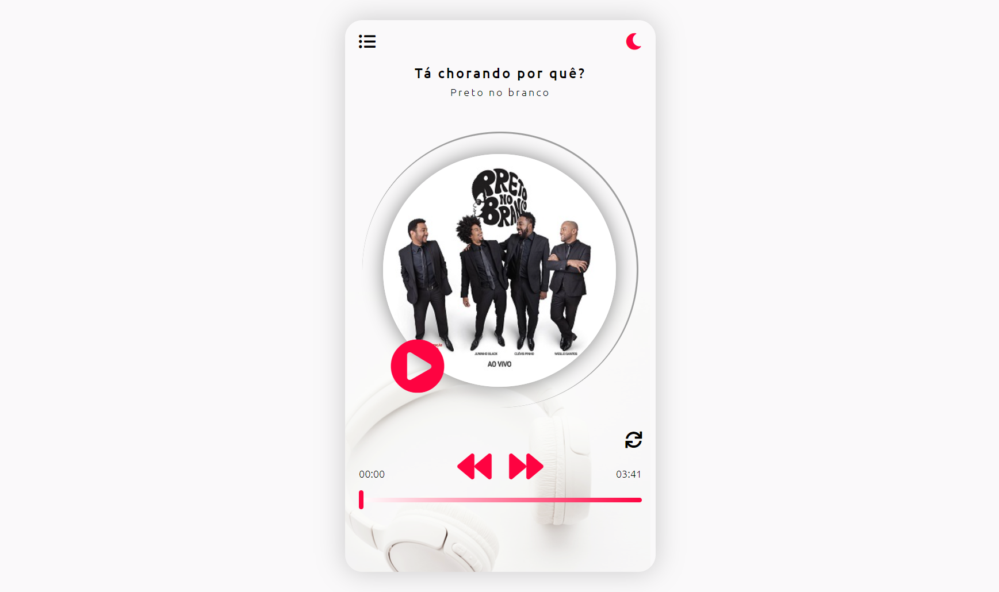
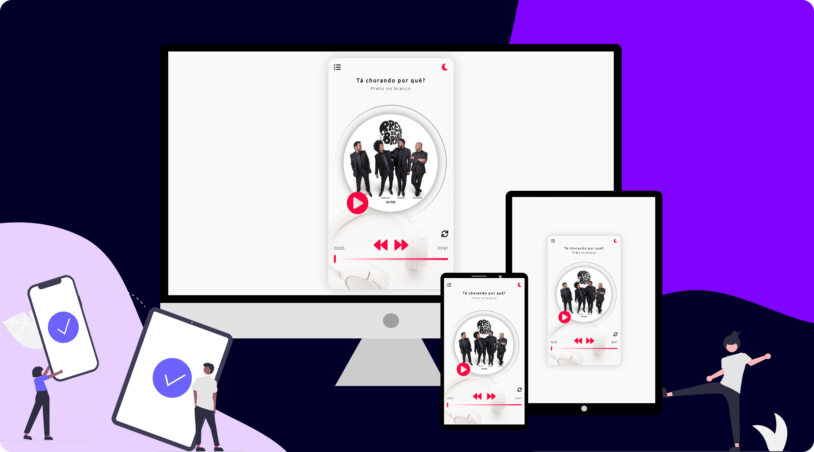

# musicplayer
Player de musica para aprender sobre métodos relacionados a áudio e vídeo, trabalhando com JavaScript.

## Projeto:

  

## Layout Responsivo:

  

## Descrição:
O foco desse projeto foi compreender e colocar em prática, alguns métodos que podemos utilizar para manipular audio e video, com JavaScript. Além de aperfeiçoar o conhecimento sobre funções, arrays e objetos.

## Principais desafios:
- Desenvolver a lógica para elaborar cada mecanismo;
- Colocar em prática os conceitos de um código limpo e organizado, evitando repetições;
- Como usar função dentro de outra;
- Acessar propriedades de um objeto;
- Importar e Exportar módulos;

## Tecnologias:

