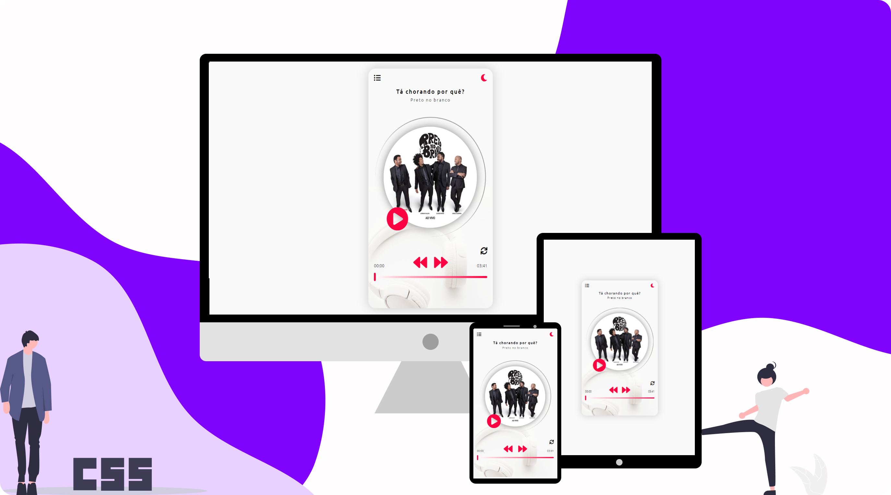

# musicplayer
Player de musica para compreender métodos relacionados a áudio e vídeo, trabalhando com JavaScript.

## Projeto:

  

## Descrição:

## Ferramentas de JavaScript:

## Principais desafios:

## Tecnologias:

